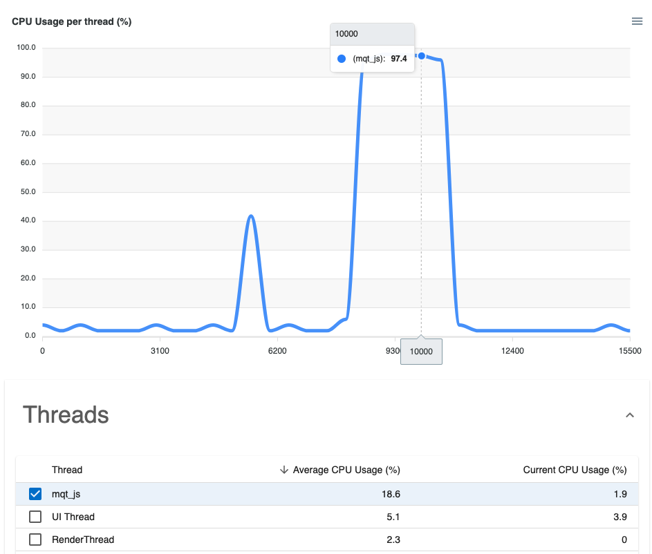

# JS Performance

## JS FPS

The React Native performance monitor has this concept of JS FPS, which helps measuring the performance of your app. 
Essentially, it should never be 0, otherwise your app will be unresponsive.

For instance, consider this simple app below.   
- The button **Click me** just increases the counter "I've been clicked x times"
- The button **KILL JS ☠️** runs expensive calculation on the JS side (recursive fibonacci suite if you're curious 😉). 

When I click **KILL JS ☠️**, the app starts to be unresponsive! You can see that the JS FPS goes down to 0 (below 0, -2 actually 😅), and **Click me** doesn't increase the counter anymore.  
In fact, it's only when **KILL JS** has finished calculating, that we finally see the counter increasing!

## Measuring JS performance with Flashlight

With Flashlight, we can track the JS thread (it's called `mqt_js`) CPU usage which is directly correlated:
- 0% JS thread CPU Usage = Max JS FPS
- 100% JS thread CPU Usage = 0 JS FPS

Using the Flipper plugin or the web reporter, you can select `mqt_js` in the thread list. You can see in this example report below that there's a big issue on JS side:

:::tip Your goal 
Your goal should be to ensure that the JS thread doesn't appear in the **Processes with high CPU usage** section.  
In fact, your goal should be that nothing appears there, in addition to having your average FPS close to 60.
:::
